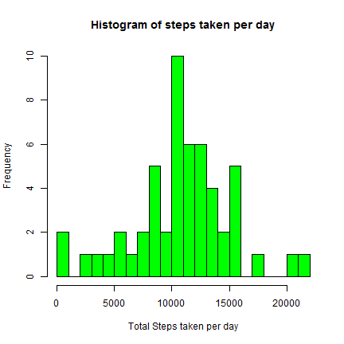
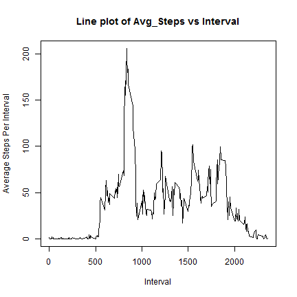
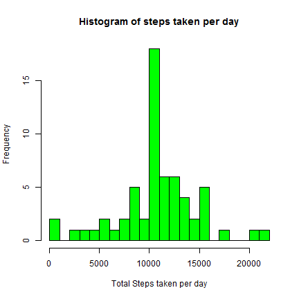
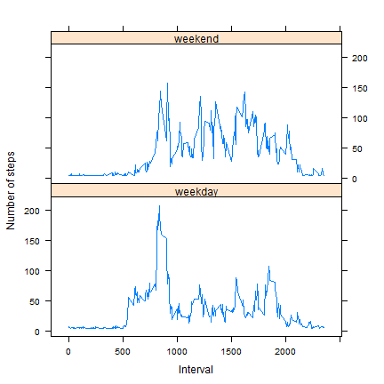

Reproducible Research: Peer Assessment 1
===================================================================

## Loading and preprocessing the data

Lets load the required libraries

```r
require(dplyr)
require(knitr)
require(lattice)
```

We will read the input activity data from the CSV file. Note that we will exclude NAs from the analysis.

```r
act<-read.csv(file="activity.csv",na.strings = "NA")
activity<-na.exclude(act)
str(activity)
```

```
## 'data.frame':	15264 obs. of  3 variables:
##  $ steps   : int  0 0 0 0 0 0 0 0 0 0 ...
##  $ date    : Factor w/ 61 levels "2012-10-01","2012-10-02",..: 2 2 2 2 2 2 2 2 2 2 ...
##  $ interval: int  0 5 10 15 20 25 30 35 40 45 ...
##  - attr(*, "na.action")=Class 'exclude'  Named int [1:2304] 1 2 3 4 5 6 7 8 9 10 ...
##   .. ..- attr(*, "names")= chr [1:2304] "1" "2" "3" "4" ...
```

```r
head(activity)
```

```
##     steps       date interval
## 289     0 2012-10-02        0
## 290     0 2012-10-02        5
## 291     0 2012-10-02       10
## 292     0 2012-10-02       15
## 293     0 2012-10-02       20
## 294     0 2012-10-02       25
```

```r
summary(activity)
```

```
##      steps                date          interval     
##  Min.   :  0.00   2012-10-02:  288   Min.   :   0.0  
##  1st Qu.:  0.00   2012-10-03:  288   1st Qu.: 588.8  
##  Median :  0.00   2012-10-04:  288   Median :1177.5  
##  Mean   : 37.38   2012-10-05:  288   Mean   :1177.5  
##  3rd Qu.: 12.00   2012-10-06:  288   3rd Qu.:1766.2  
##  Max.   :806.00   2012-10-07:  288   Max.   :2355.0  
##                   (Other)   :13536
```

We will perform some basic data preparation to convert date column from factor to a date data type.

```r
activity<-mutate(activity, date=as.Date(as.character(date)))
act<-mutate(act, date=as.Date(as.character(date)))
```

## What is mean total number of steps taken per day?

First we will calculate the total number of steps taken per day. Note that NA are ignored

```r
act1<-summarize(group_by(activity,date),sum(steps,na.rm=TRUE))
colnames(act1)[2]<-"sum_steps"
```

We will plot a histogram to see the distribution. 

```r
hist(act1$sum_steps,col="green",breaks=25,main="Histogram of steps taken per day",xlab="Total Steps taken per day")
```



We will now calculate the mean and median of the the total number of steps taken per day


```r
mean_act<-mean(act1$sum_steps)
med_act<-median(act1$sum_steps)
```

The mean and median of the total number of steps taken per day are 1.0766189 &times; 10<sup>4</sup> and 10765 respectively.


## What is the average daily activity pattern?

First we will calculate the average number of steps taken per interval. Note that NA are ignored


```r
act2<-summarize(group_by(activity,interval),mean(steps,na.rm=TRUE))
colnames(act2)[2]<-"avg_steps"
```

We will now plot a time series of interval on x-axis and average steps per interval on y-axis.


```r
with(act2,plot(act2$interval,act2$avg_steps,type="l", xlab="Interval", ylab="Average Steps Per Interval", main="Line plot of Avg_Steps vs Interval"))
```



Lets find out the interval which, on average, has the highest number of steps


```r
interval<-act2[act2$avg_steps==max(act2$avg_steps),]$interval
steps<-act2[act2$avg_steps==max(act2$avg_steps),]$avg_steps
```

The maximum steps, on average per interval, is 206.1698113 and it occurs during the interval 835 

## Imputing missing values


```r
na_count<-length(act$steps[is.na(act$steps)])
```

The total number of NAs in steps is 2304.  

We will create a new data frame called act4. Act4 contains NAs, which will be replaced.


```r
act3<-activity
act4<-act
act3<-summarize(group_by(activity,date,interval),mean(steps,na.rm=TRUE))
colnames(act3)[3]<-"mean_steps"
mean_steps<-mean(act3$mean_steps,na.rm = TRUE)
act4$steps[is.na(act4$steps)]<-mean_steps
```
All NA values from steps have been replaced with the mean of the steps per day per interval (the actual value used for replacement is 37.3825996 ). Please note this is the mean of steps per day per interval

To calculate mean and median values,  we will calculate the total number of steps taken per day. Note that NA are ignored


```r
act5<-summarize(group_by(act4,date),sum(steps,na.rm=TRUE))
colnames(act5)[2]<-"sum_steps"
```

We will plot a histogram to see the distribution. 

```r
hist(act5$sum_steps,col="green",breaks=25,main="Histogram of steps taken per day",xlab="Total Steps taken per day")
```



We will now calculate the mean and median of the the total number of steps taken per day


```r
mean_act_na<-mean(act5$sum_steps)
med_act_na<-median(act5$sum_steps)
print(paste("Mean before imputed NA is:",mean_act))
```

```
## [1] "Mean before imputed NA is: 10766.1886792453"
```

```r
print(paste("Median before imputed NA is:",med_act))
```

```
## [1] "Median before imputed NA is: 10765"
```

```r
print(paste("Mean after imputed NA is:",mean_act_na))
```

```
## [1] "Mean after imputed NA is: 10766.1886792453"
```

```r
print(paste("Median after imputed NA is:",med_act_na))
```

```
## [1] "Median after imputed NA is: 10766.1886792453"
```
Both mean values are same before and after NAs have been replaced.This is because we have used the mean per date per interval for all NA values, hence the overall mean are not affected. The median values have increased by a very slight amount because of the addition of the means to NA's, ushing the median out by a small margin. 


## Are there differences in activity patterns between weekdays and weekends?

Lets use an existing data frame called act4 and add a factor variable (wk_day).


```r
act4<-mutate(act4,wk_day=weekdays(date))
act4$wk_day[act4$wk_day %in% c("Saturday","Sunday")]<-"weekend"
act4$wk_day[!(act4$wk_day %in% c("weekend"))]<-"weekday"
act4$wk_day<-as.factor(act4$wk_day)
str(act4)
```

```
## 'data.frame':	17568 obs. of  4 variables:
##  $ steps   : num  37.4 37.4 37.4 37.4 37.4 ...
##  $ date    : Date, format: "2012-10-01" "2012-10-01" ...
##  $ interval: int  0 5 10 15 20 25 30 35 40 45 ...
##  $ wk_day  : Factor w/ 2 levels "weekday","weekend": 1 1 1 1 1 1 1 1 1 1 ...
```

Now lets create a panel plot using the factor variable we just created for weekend. Note that the steps have been averaged across weekend factor varible as well as interval.


```r
act4<-summarize(group_by(act4,wk_day,interval),mean(steps))
colnames(act4)[3]<-"avg_steps"
xyplot(avg_steps ~ interval| wk_day,data = act4,type = "l",xlab = "Interval",ylab = "Number of steps",layout=c(1,2))
```



based on the panel plot, there is a difference in activity patterns between weekday and weekend. During weekends, the activity levels are consistently high throughout the day, whereas during weekdays there is a spike in activity mostly during the start and end of the day only.
